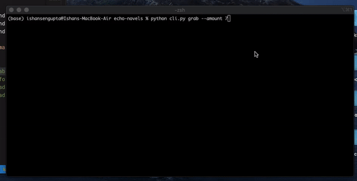

# Light Novel CLI

A command line tool to read and navigate through web novel/light novel websites in the terminal. Uses machine learning and text summarization algorithms to get summaries for specified number of chapters for an inputted story.

----

### TODO
---
- [x] Created a method to get summaries for previous chapters
- [x] Created ability to query most popular novels from website
- [x] Option to download text as epub
- [x] Added multi-threading for collecting summary text
- [ ] Add options for more websites

